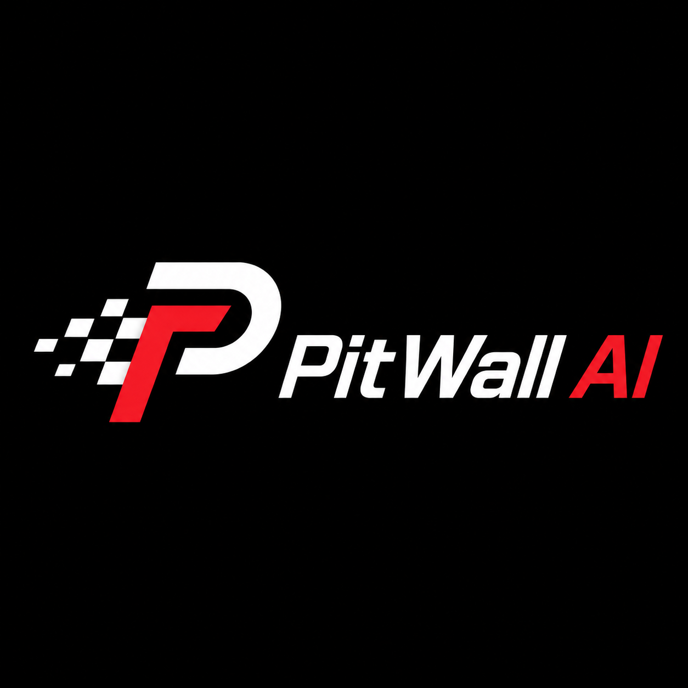
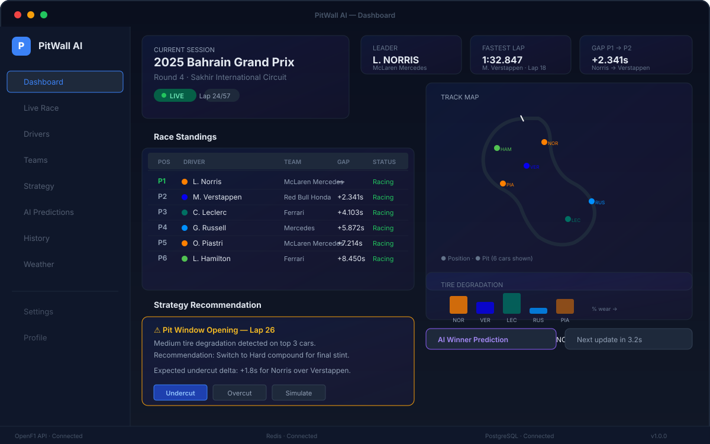
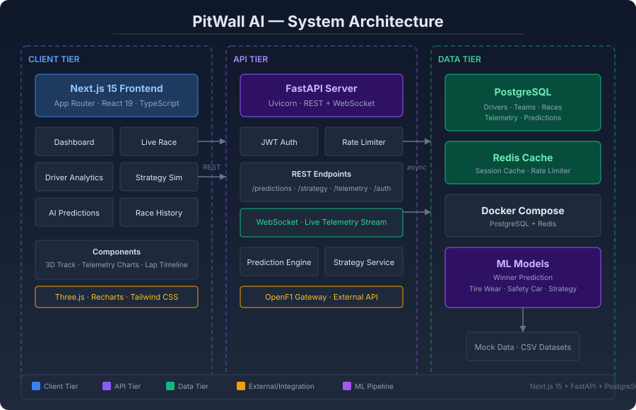

<div align="center">

  

  <h1>PitWall AI</h1>

  <p><b>Modern Formula 1 Race Strategy Analytics Platform</b></p>

  <p>
    
    
    
    
    
    
    
    
    
  </p>

  <br/>

  

  <br/>
  <br/>

</div>

---

## ✦ Features

<table>
  <tr>
    <td width="50%">
      <h3>🏎️ Live Race Dashboard</h3>
      <p>Real-time race standings with position tracking, gap analysis, and live timing updates via WebSocket streaming.</p>
    </td>
    <td width="50%">
      <h3>🔄 Strategy Simulator</h3>
      <p>Simulate pit strategies, undercut/overcut scenarios, and tire compound choices with race-long projections.</p>
    </td>
  </tr>
  <tr>
    <td>
      <h3>📊 Telemetry Analytics</h3>
      <p>Driver-to-driver telemetry comparison with speed traces, throttle/brake overlays, gear maps, and sector splits.</p>
    </td>
    <td>
      <h3>🤖 AI Prediction Engine</h3>
      <p>Machine learning models for winner prediction, tire wear estimation, safety car probability, and optimal pit strategy.</p>
    </td>
  </tr>
  <tr>
    <td>
      <h3>🌍 3D Track Visualization</h3>
      <p>Three.js-based 3D track map with live car positions, driver labels, and orbit controls for any circuit layout.</p>
    </td>
    <td>
      <h3>🌧️ Weather Impact Analysis</h3>
      <p>Track weather conditions, rain probability windows, and compound performance across temperature ranges.</p>
    </td>
  </tr>
  <tr>
    <td>
      <h3>📋 Driver & Team Analytics</h3>
      <p>Head-to-head driver comparisons, team performance trends, qualifying vs race pace breakdowns.</p>
    </td>
    <td>
      <h3>🎯 Historical Analysis</h3>
      <p>Full race history with session replay, lap-by-lap position changes, pit stop analysis, and race outcome comparisons.</p>
    </td>
  </tr>
</table>

---

## ✦ Architecture



| Tier | Stack |
|------|-------|
| **Client** | Next.js 15 (App Router) · React 19 · TypeScript · Three.js · Recharts · Tailwind CSS 4 |
| **API** | FastAPI · Uvicorn · JWT Auth · Rate Limiter · WebSocket Streaming |
| **Data** | PostgreSQL 16 · Redis 7 · Docker Compose |
| **ML** | Scikit-learn · TensorFlow/Keras · Pandas · NumPy |
| **External** | OpenF1 API · Ergast API (legacy) · FastF1 (offline ingestion) |

---

## ✦ Quick Start

### 1. Frontend

```bash
cd frontend
npm install
npm run dev
```

Open [http://localhost:3000](http://localhost:3000).

### 2. Backend

```bash
docker compose up -d
cd backend
python3 -m venv .venv
source .venv/bin/activate
pip install -r requirements.txt
uvicorn app.main:app --reload --port 8000
```

API docs at [http://localhost:8000/docs](http://localhost:8000/docs).

### 3. ML Models

```bash
cd ml-models
python3 -m venv .venv
source .venv/bin/activate
pip install -r requirements.txt
PYTHONPATH=. python pitwall_ml/train.py
```

Artifacts are written to `ml-models/artifacts/`.

---

## ✦ Key API Endpoints

| Method | Path | Description |
|--------|------|-------------|
| `GET` | `/health` | Health check |
| `POST` | `/api/v1/auth/login` | JWT authentication |
| `GET` | `/api/v1/predictions/winner` | Winner prediction |
| `POST` | `/api/v1/strategy/simulate` | Strategy simulation |
| `GET` | `/api/v1/predictions/safety-car` | Safety car prediction |
| `WS` | `/api/v1/ws/telemetry` | Live telemetry stream |

---

## ✦ Project Structure

```
pitwall-ai/
├── frontend/          # Next.js 15 application (App Router)
│   ├── app/           # Route pages (dashboard, live-race, strategy, ...)
│   ├── components/    # React components (charts, track, analysis, simulator)
│   ├── lib/           # Data fetching, hooks, utilities
│   └── public/        # Static assets
├── backend/           # FastAPI server
│   ├── app/api/       # REST endpoints
│   ├── app/core/      # Config, auth, OpenF1 gateway
│   ├── app/models/    # SQLAlchemy domain models
│   ├── app/services/  # Prediction engine, caching
│   └── app/db/        # Database session management
├── ml-models/         # Machine learning pipelines
│   └── pitwall_ml/    # Winner prediction, tire wear, safety car, strategy
├── docker-compose.yml # PostgreSQL + Redis infrastructure
└── docs/              # Architecture documentation
```

---

## ✦ Data Sources

The platform integrates with the **OpenF1** live API for real-time race data (positions, intervals, laps, weather, car telemetry, pit stops, race control messages). A legacy **Ergast** compatible gateway is available, and **FastF1** is used for offline ingestion and historical dataset generation.

---

<div align="center">
  <sub>Built with Next.js 15 · FastAPI · PostgreSQL · Redis · Three.js · Recharts</sub>
  <br/>
  <sub>PitWall AI &copy; 2025</sub>
</div>
